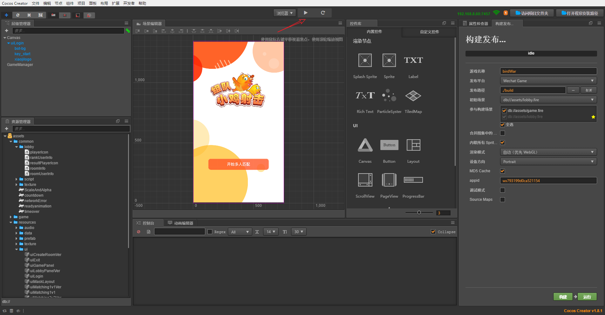
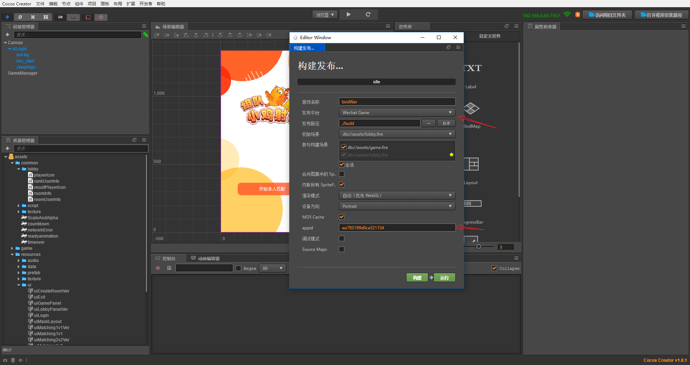
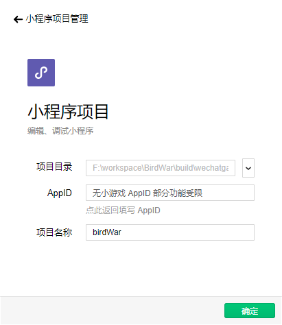
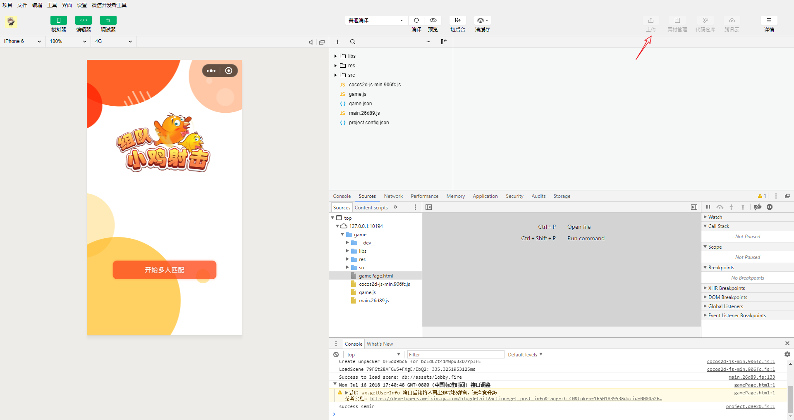

# BirdWar

## CC游戏案例之 组队吃鸡

## 环境准备

1. 下载安装[cocos creator](http://www.cocos.com/download)v1.8.1或以上版本
2. 可以不更新本项目使用的matchvs插件,如果想需要使用最新的插件,可以在cocos creator中下载插件,
对应的[教程](http://www.matchvs.com/service?page=creatorStart)

## 下载游戏

1. git clone https://github.com/matchvs/BirdWar.git
2. 用cocos creator打开该项目文件BirdWar

## 运行游戏

###  web版体验

1. 打开之后,出现以下界面

2. 点击中上方的三角形按钮,即可运行游戏
3. 就可以愉快的玩耍了 

###  微信版体验

1. 在cocos creator打包输出微信小游戏项目,点击cocos creator上的导航栏中的项目
2. 在构建发布界面中,发布平台为"Wechat Game",填入appid(如果是你自己的项目,你需要在微信开发者平台中申请).

3. 点击构建,之后点击运行.
4. 点击运行之后,会自动使用微信开发者工具打开.
 
注意: 如果点击运行,小游戏自动打开失败,需要手动打开build/wechatgame.

5. 微信开发者工具打开之后,就可以愉快的玩耍了 

6. 发布到微信平台,详细细节查看[微信开发者文档](https://developers.weixin.qq.com/minigame/dev/index.html)